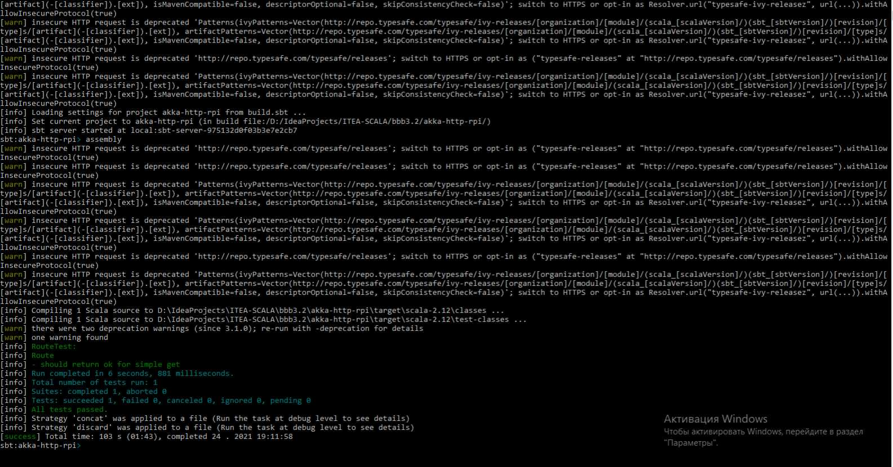

# Akka-Http to assembly on JAR

* `Repo`: https://github.com/matsluni/akka-http-rpi
* [Blog post on the spray blog](<http://spray.io/blog/2013-07-23-spray-on-the-raspberry-pi/>)
* [Code for old spray blog post](https://github.com/matsluni/spray-template)

Чтобы начать работу, выполните следующие действия:

1. Git-clone this repository.

        $ git clone git://github.com/matsluni/akka-http-rpi.git

2. Change directory into your clone:

        $ cd akka-http-rpi

3. Launch SBT:

        $ sbt

4. Create an assembly

        > assembly

    

5. Start the application:

        > java -jar akka-http-rpi-assembly-0.0.1.jar

    
    

6. Browse to http://localhost:8082/

    

---

4. Compile everything and run all tests:

        > compile

5. Start the application:

        > run

6. Browse to http://localhost:8082/

7. Create an assembly and deploy to your Raspberry Pi

        > assembly
        
        > scp target/scala-2.11/akka-http-rpi-assembly-0.1.jar pi@raspberrypi:~/

8. Start akka-http on the Raspberry Pi

- RPI 1

        > ~/jdk1.8.0_66/bin/java -Xss1M -Xms64M -Dakka.actor.default-dispatcher.fork-join-executor.parallelism-max=2 -jar akka-http-rpi-assembly-0.1.jar

- RPI 2

        > ~/jdk1.8.0_66/bin/java -Xss2M -Xms128M -jar akka-http-rpi-assembly-0.1.jar

## Benchmark with [wrk](https://github.com/wg/wrk)

    wrk -c 30 -t 20 -d20s http://raspberrypi:8080/

В моих тестах я мог достичь около 520 запросов в секунду с этой настройкой, но эта настройка никоим образом не оптимизирована.
В дальнейших тестах я хочу продолжить исследование и увидеть в действии некоторое противодавление.
